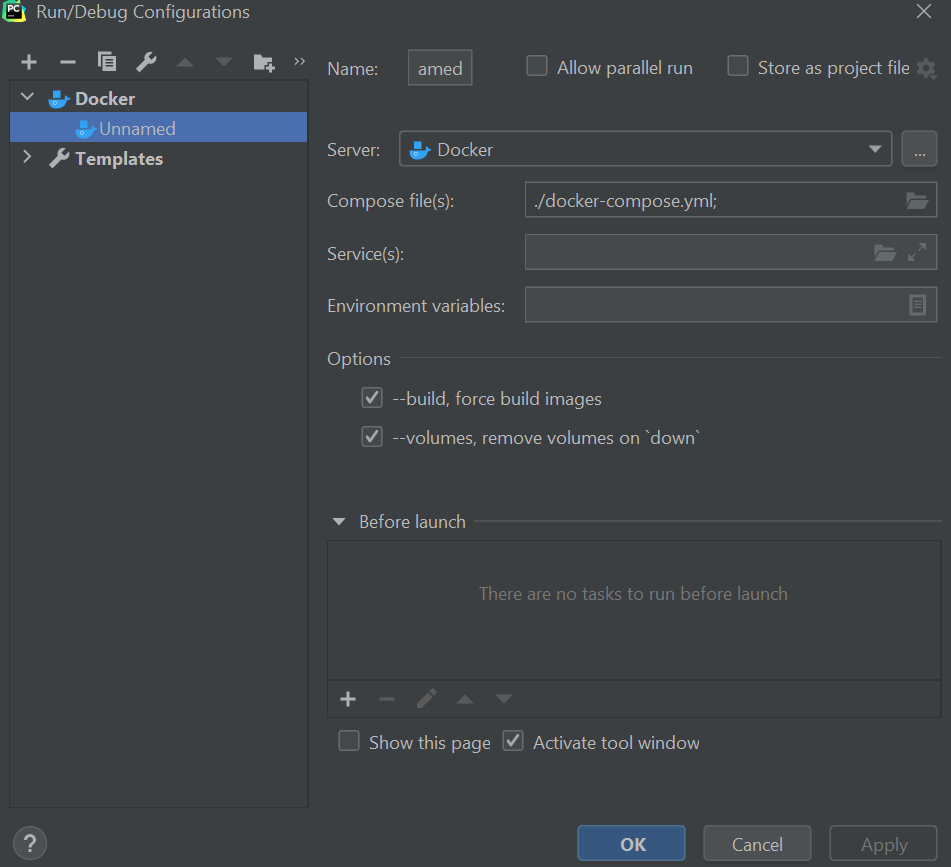
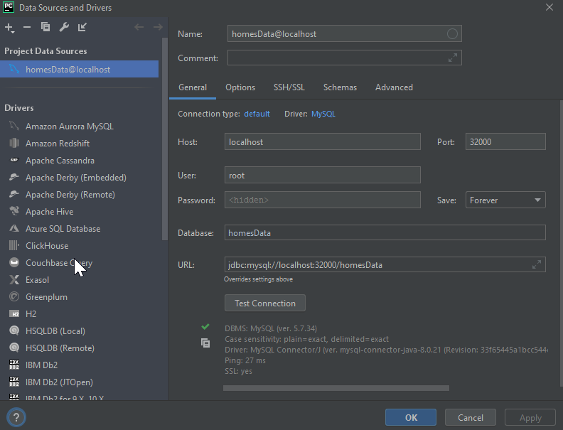
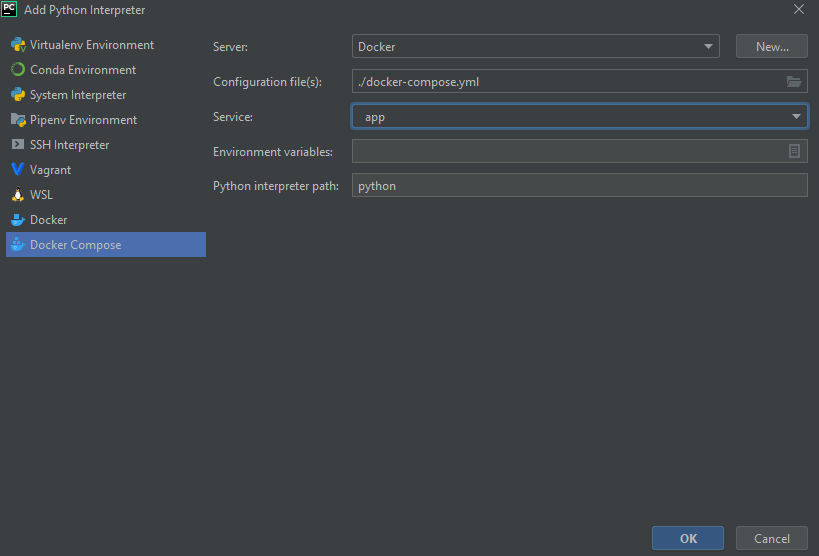
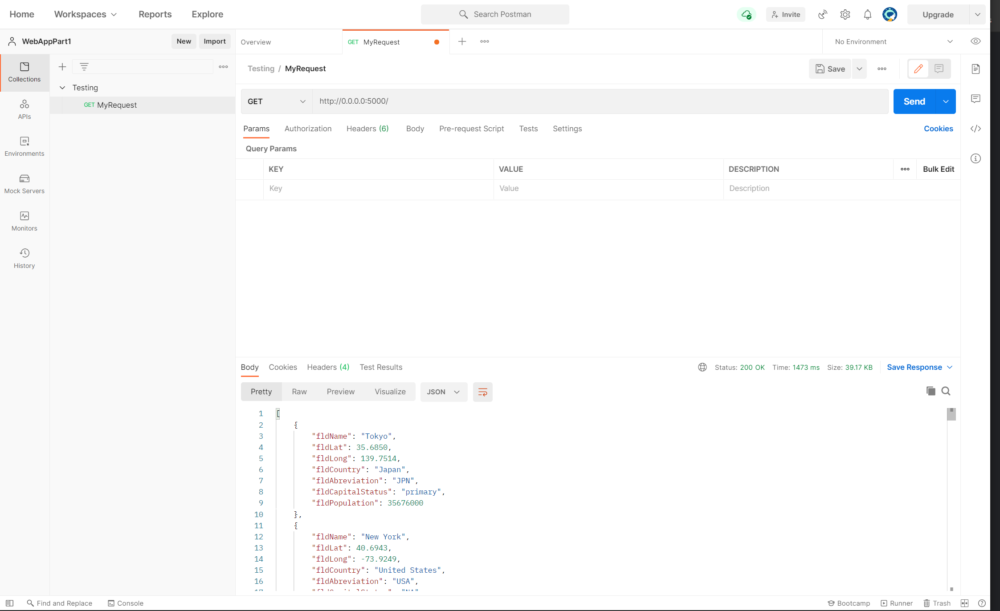
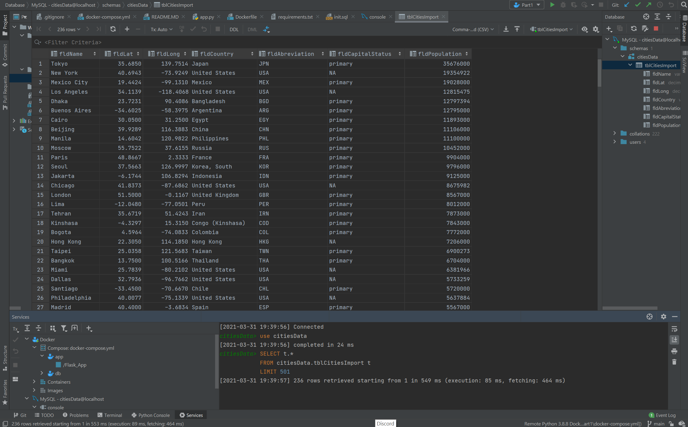
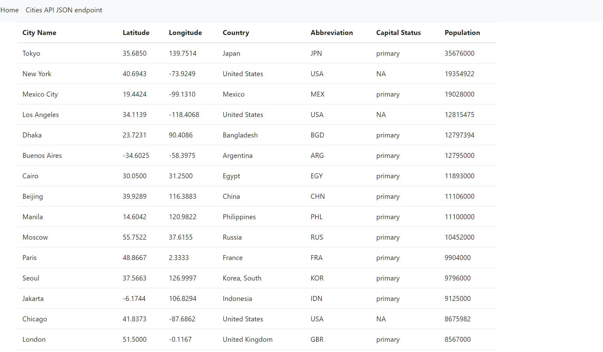
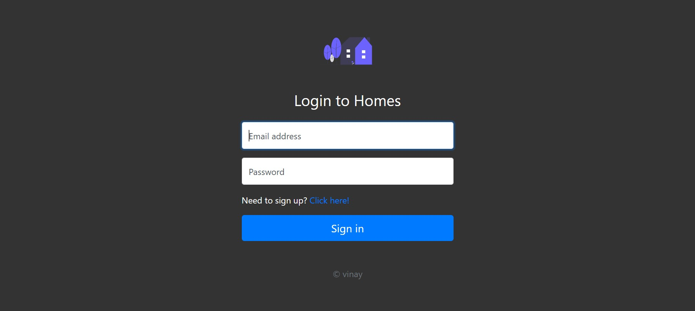

# Project Description

This project main is to create app by using Pycharm setup with Docker, Flask, MySQL

# Installation Instructions for Using the App with Docker

## 1. Installing Docker

**A, Instructions for Windows Users**

There are needed requirements to install Docker Desktop:

* Windows 10, version 1903 or higher
* WSL 2 feature is enabled
* Prerequisites for running WSL 2 on Windows 10
* 64 bit processor
* 4GB system RAM
* BIOS-level hardware virtualization support must be enabled in the BIOS settings
* Linux kernel update package is installed

If all requirements are met, we can download Docker Desktop Installer.exe from Docker Hub. After that, we need to just
double-click on the file to run the installer. It is highly important that we ensure the Enable WSL 2 Features option is
selected on the Configuration page. By following the instructions given by the installation wizard, we can proceed with
the installation. Docker Desktop does not run automatically after we installed it. To start the program, we need to
search for it on our computer and run the docker.

After the configuration, we can run the project. If the project is running successfully, we can connect our MSQL
database to our project. We go to View, then Tool Windows; finally, we choose Database. Here, we click on the + sign, on
Data Source, then on MYSQL. We give our database a name: "homesData". The port needs to be set to 32000. We give "root"
as user, and "root" as password. Finally, we can click on Test Connection, then Apply and OK.

After these steps, we need to add an interpreter. We choose Docker Compose, give the path to docker-compose.yml and
select app as a service. Finally, we click on OK. Now, we are able to choose the newly added interpreter.

We run the app again, then in order to see the website, we type "http://localhost:5000" into the address bar of our
internet browser.

# Postman Screenshot

# SQL Data Screenshot

# Bootstrap HTML template

# login page template

